<link rel="stylesheet" href="assets/css/accordion.css">

Blog post to [**RUDDER: Return Decomposition for Delayed Rewards**][arxiv-paper].

Recently, tasks with **delayed rewards** that required **model-free** reinforcement learning attracted a lot of attention via complex strategy games. For example, DeepMind currently focuses on the delayed reward games [**Capture the flag**][capture-the-flag] and [**Starcraft**][starcraft-paper], whereas Microsoft is putting up the [**Marlo**][Marlo-Challenge] environment, and Open AI announced its [**Dota 2**][Dota-blog] achievements. Mastering these games with delayed rewards using model-free reinforcement learning poses a great challenge and an almost insurmountable obstacle, see the excellent [**Understanding OpenAI Five**][Und-Dota-5] blog. Delayed rewards are very common as they typically appear in reinforcment learning (RL) tasks with episodic or sparse rewards. They impose a fundamental problem onto learning whose solution is a [**long standing challenge in RL (abstract, p. vii)**][sutton-thesis]. For complex real-world tasks, e.g. autonomous driving or controling smart cities, appropriate models are not available and difficult to learn and, thus, only model-free reinforcement learning is feasible.

Via RUDDER, we introduce a novel model-free RL approach to overcome **delayed reward problems**. RUDDER **directly and efficiently assigns credit to reward-causing state-action pairs** and thereby speeds up learning in model-free reinforcement learning with delayed rewards dramatically.

# The main idea of RUDDER

This is a **5 min read** of the main idea of RUDDER:

We propose a paradigm shift for **delayed rewards** and **model-free** reinforcement learning. A reason is that conventional methods have problems, therefore:  
  1.  Do not use temporal difference (TD) since it suffers from vanishing information and leads to high
       bias, even with eligibility traces.
  2.  Do not use Monte Carlo (MC) since averaging over all possible futures leads to high variance.
  3.  Do not use conventional value functions based on state-action pairs since the expected return
       has to be predicted from every state-action pair. A single prediction error might hamper learning.  

**Supervised Learning**: Assume you have high reward and average reward episodes. Supervised learning identifies state-action pairs that are indicative for high rewards. We therefore want to adjust the policy such that these state-action pairs are reached more often. **Reward redistribution** to these state-action pairs achieves these adjustments.  

**Value function is a step function**: The main idea of RUDDER is to exploit the fact that the value function is a step function. Complex tasks are hierarchical with sub-tasks or sub-goals. Completing them is reflected by a step in the value function. In this sense, steps indicate events like achievements, failures, or change of environment/information. In general, a step in the value function is a change in return expectation (higher/lower amount of return or higher/lower probability to receive return). The reward is redistributed to these steps. In particular, identifying the large steps is important since they speed up learning tremendously:
  * Large increase of return (after adjusting the policy).
  * Sampling more relevant episodes.  

In this simple key-door example an agent has to take a key to open the door to a treasure room where it will find the treasure.
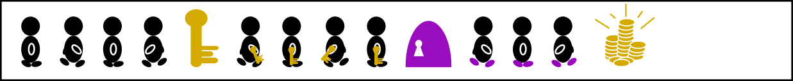  
Both getting the key and opening the door increases the probability of obtaining the treasure. Therefore, the resulting value function has a step for getting the key and a step for opening the door, respectively.
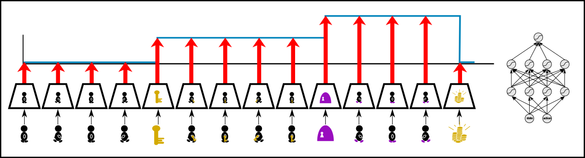  

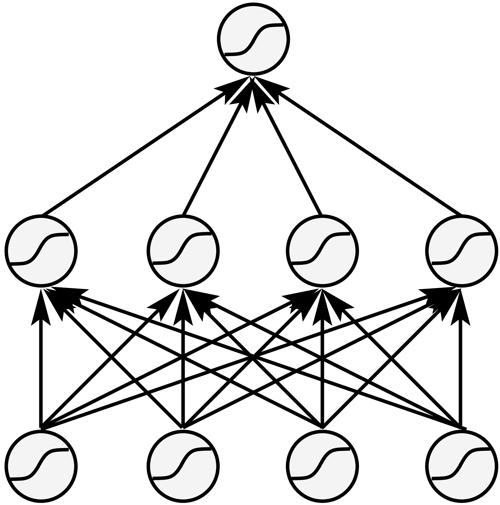
**Feed-forward networks:** Learning step functions by fully connected networks requires to **extract the expected return from every state-action pair**. In the above figure, conventional value function learning has to extract from every input image the fact that the agent posses a key to determine the correct expected return. However, the expected return does not change after "getting the key" until "opening the door" and after "opening the door" until "getting the treasure". Consequently, in these intervals the value function is constant. There is no new information regarding the expected return, whereas only the previous information is repeatedly extracted. Such intervals can span thousands of time steps, from each of which the expected return has to be extracted, even if it does not change.
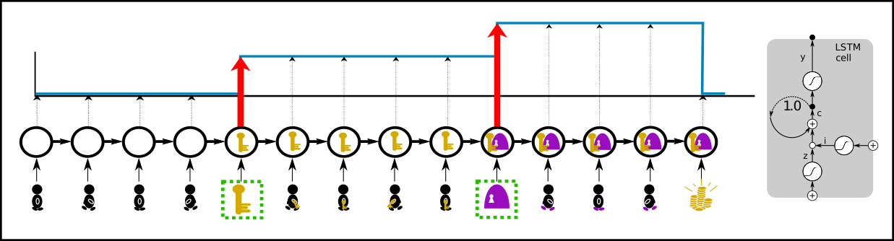  

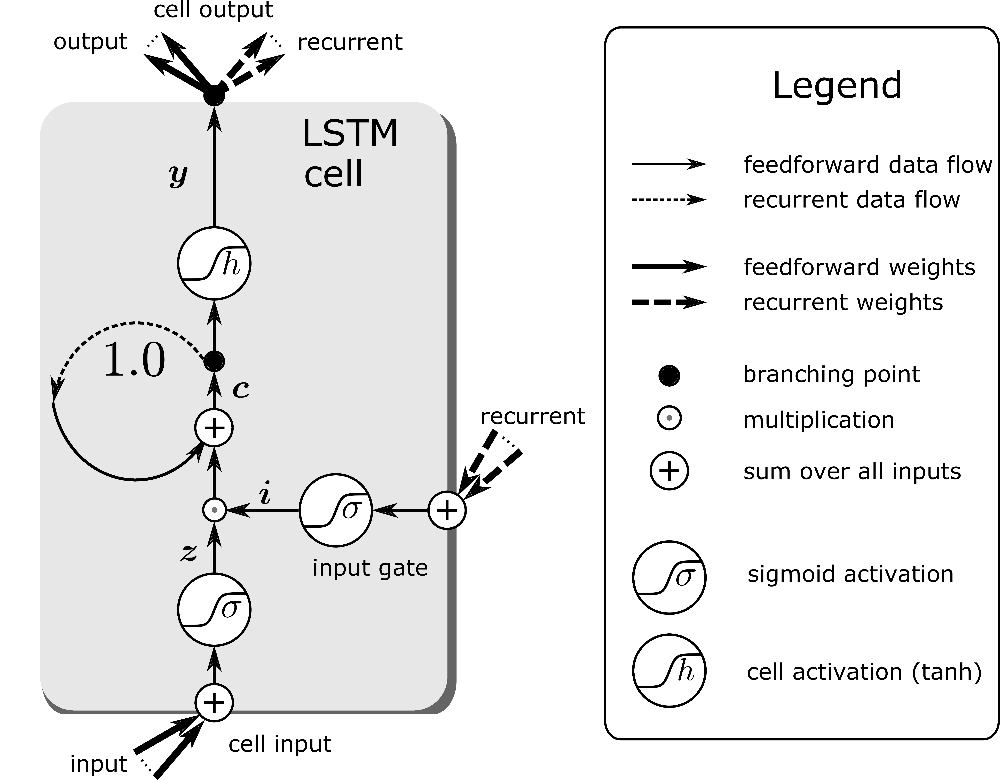
**Recurrent neural networks**: Learning step functions by memorizing events (steps, new information) is much more **sample efficient**. Only the patterns of the relevant events "getting the key" and "opening the door" have to be learned to represent the whole value function. These events have to be stored to determine the correct expected return. At time points where the value does not change nothing has to be learned. This is very efficient if there are only a few steps. We suggest to use an LSTM network where only the relevant events are stored in the memory cells, whereas for irrelevant events the LSTM memory cells do not change and the LSTM output remains constant as desired.

​
**Reward redistribution**: Reward is redistributed to the steps in the value function (green arrows below). Reward redistribution is a fixed procedure that redistributes for each episode either the realization or the expectation of the return along the state-action sequence to the steps. **The redistributed reward replaces the original reward** (state-action pairs are kept) in a new environment. In an optimal reward redistribution the **expected future rewards are always equal to zero** (blue line at zero in the last row below). $$Q$$-value estimation simplifies to computing the mean, therefore learning is very efficient.
​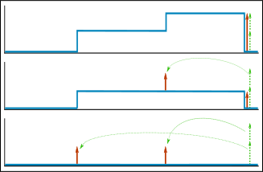  

**Return decomposition**: The reward redistribution is obtained via return decomposition of the recurrent neural network. Return decomposition identifies the steps of the value function from the recurrent neural network (green arrows above) which determine the redistributed rewards. The steps are identified via contribution analysis, which calculates the contribution of inputs to the prediction of the return.

# RUDDER explained on a more detailed example

This is a **20 min read** of the basic concepts of RUDDER.  

The following fundamental contributions of RUDDER will be explained on the pocket watch example task:  

* **Return-equivalent decision processes** with the same optimal policies.
* **Reward redistribution** that leads to return-equivalent decision processes.
* **Optimal reward redistribution** that leads to zero expected future rewards. 
* **Return decomposition** via contribution analysis.  

Based on the pocket watch example task, this blog will walk you through the topics of delayed rewards, expected future rewards equal to zero, return equivalence, reward redistribution and return decomposition via contribution analysis. We show how RUDDER effectively solves the credit assignment problem for delayed rewards.

# An example task for delayed rewards  

In the pocket watch example task, assume you repair pocket watches and then sell them. For a particular brand of watch you have to decide whether repairing pays off. The sales price is known, but you have unknown costs, i.e. negative rewards, caused by repair and delivery. In this example task, **delayed rewards** are present when you decide for a watch of a particular brand whether repairing it pays off on average. The sales price is known, but you have unknown immediate repair and future delivery costs. The reward is delayed because only when you know your total expenses, you realize if your decision of repairing this watch of this particular brand has paid off.  
​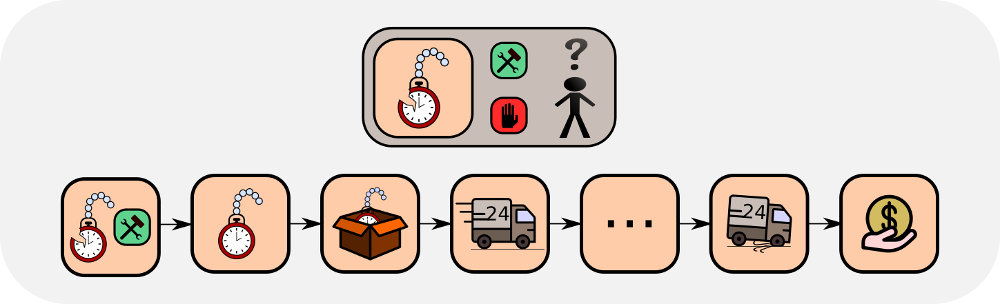  

# The problem formulation
You have to decide for a particular brand of watch if repairing pays off. The advantage function is the sales price minus the expected immediate repair costs minus the expected future delivery costs. Repairing pays off if the advantage function is positive.

# Classical RL methods

Most **classical RL methods**, like temporal difference (TD) learning, Monte Carlo learning and Monte Carlo Tree Search, try to solve RL problems by estimating the return, i.e. the accumulated future reward. Therefore, they have to average over a large number of possible futures. Especially for delayed reward problems this has severe drawbacks.

In the example task, many events lie between "deciding whether to repair" and actually selling the watch. Only the return can tell you if repairing pays off. To evaluate the decision, **temporal difference (TD)** learning minimizes the TD error, which comes down to propagating the rewards back. The backpropagated reward corrects the bias of the TD return estimation at previous states. Unfortunately, TD learning needs a vast number of updates to propagate the reward back, which increases exponentially with the length of the path to previous states, thus bias correction is exponetially slow. Consequently, for such problems TD approaches are not feasible. In [**Sutton and Barto's book**][sutton-book], page 297, formula 12.11, it is shown that the TD(λ)-return **vanishes exponentially**.

​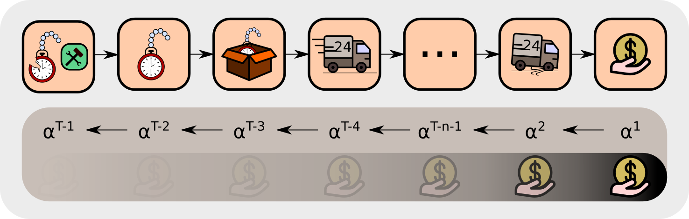

      

        <label for="a1">Closer look at the TD update rule:</label>
        <input type="checkbox" name="sr" id="a1" hidden />
        

          
          {{ accordion_include | markdownify }}
        

      

    

The decision could also be evaluated by **Monte Carlo** learning. Monte Carlo averages in a probabilistic environment over the returns of all possible futures, which number can be be very large. If the returns have high variance, then Monte Carlo learning is very slow. Thus Monte Carlo learning has problems with **high variance**, in contrast to TD.

​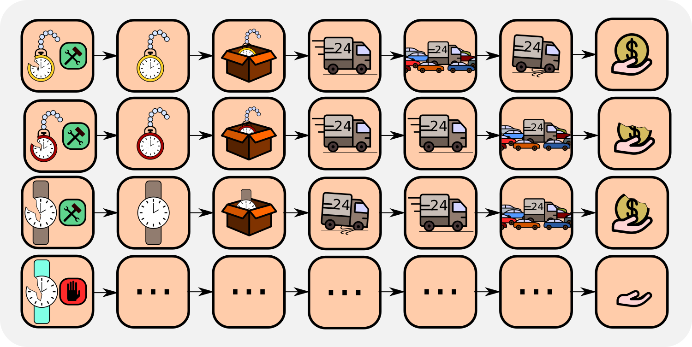  

We conclude that for long-delayed reward tasks, both TD and TD(λ) learning are exponentially slowed down with the length of the delay. On the other hand, Monte Carlo learning has problems with high sample variance of the return, as it is typical for probabilistic environments.

# Zero future expected rewards
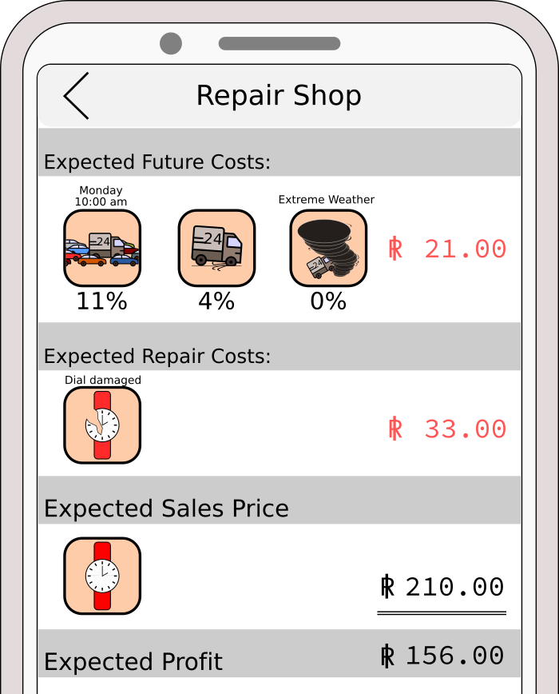
As explained in "The main idea of RUDDER" in the introduction, we aim at a reward redistribution to the steps of the value function which tremendously simplifies learning. Therefore, RUDDER's main goal is to construct an MDP that **has expected future rewards equal to zero**, in contrast to most classical RL methods. If this goal is achieved, Q-value estimation will simplify to computing the mean of the immediate rewards. In the example task, if the expected future costs (average delivery costs) are known, solving the task becomes trivial. The expected future costs can be added to the repair costs, resulting in zero future costs. As a result, you just have to average over the repair costs. For getting this average, you use your repairing experiences for this brand.  

Why is it advantageous having the expected future rewards equal to zero? The expected profit can be estimated easily by averaging over the immediate repairing cost since all future rewards are equal to zero. There estimation neither suffers from exponetially decaying reward propagation like TD, nor from high variance like MC learning. Since, there is no need to average over all possible trajectories (like in MC) or to propagate the delayed reward back (like in TD). Instead the expected profit is given immediately, the decision is made and no further reward is expected.  

In the example task, for the decision to repair the watch or not and for zeroing the expected future rewards only the brand-related delivery costs, e.g. packing costs, have to be estimated. The descision to repair or not can only influence those costs (negative rewards). Unfortunately, the average delivery costs are a superposition of brand-related costs and brand-independent costs, e.g. time spent for delivery. So, how can we disentangle brand-related from brand-independent costs?

# Return decomposition and pattern recognition
​In order to estimate brand-related costs, **return decomposition** is used, which relies on **pattern recognition**. In the example task, the average delivery costs are a superposition of brand-related costs and brand-independent costs (general delivery costs). One can assume that the brand-independent costs are indicated by patterns. If it is snowing delivery is usually delayed making the costs go up. If delivery runs into a traffic jam it is usually delayed. If your delivery truck gets a flat tire then delivery costs are higher. There are many more examples. The idea is to use a training set of completed deliveries, where supervised learning can identify patterns for these events and attribute costs to them. In this way, RUDDER manages to push the expected future rewards towards zero by identifying key events and redistributing rewards to them. Removing brand-independent delivery costs associated with key events from the return considerably reduces the variance of the remaining return and, hence estimating brand-related costs becomes much more efficient.

In RUDDER, zeroing the expected future reward and redistributing the reward is mathematically endorsed by introducing the concepts of **return-equivalent decision processes, reward redistribution, return decomposition and optimal reward redistribution**.

# RUDDER - more technical:

      

        <label for="a2">MDP definitions:</label>
        <input type="checkbox" name="sr" id="a2" hidden />
        

          
          {{ accordion_include | markdownify }}
        

      

    

# Return equivalent decision processes

​
A sequence-Markov decision process (SDP) is defined as a decision process which is equipped with a Markov policy and has Markov transition probabilities but a reward that is not required to be Markov.
Two SDPs $$\tilde{\mathcal{P}}$$ and $$\mathcal{P}$$ are **return-equivalent** if

* they differ only in their transition-reward distributions
* they have the same expected return at $$t=0$$ for each policy $$\pi: \tilde{v}_0^{\pi} = v_0^{\pi}$$

We show that return-equivalent SDPs have the **same optimal policies**. In RUDDER, the idea is to transform an MDP with delayed rewards into a different but return-equivalent SDP where rewards are less delayed, therefore easier to learn.

Concretely, in our example task, the original MDP gives the reward at the very end when the repaired watch is sold. RUDDER redistributes the reward to key events and creates a new SDP which is ensured to be return-equivalent to the original MDP. Consequently and contrary to the original MDP, the decision of repairing the watch will be immediately rewarded.   

# Return decomposition

The **return decomposition** determines the contribution of each state-action pair to the return - the return is decomposed. The contribution of each state-action pair is the new reward and ensures a reward redistribution which leads to a new, return-equivalent MDP. The contribution is found by learning a function that predicts the return of each state-action sequence. Subsequently, this function helps to distribute the return over the sequence. Conceptually, this is done via **contribution analysis** where the contribution of each sequence element to the prediction of the return is determined. We look at how much the current input contributes to the final prediction and consider three contribution analysis methods, although in practice any contribution analysis method could be used:

* "Differences in prediction''
* [**Integrated gradients**][int-grad]
* [**Layer-wise relevance propagation**][lrp]

We prefer differences in prediction, where the change in prediction from one timestep to the next is a measure of the contribution of an input to the final prediction.

# Optimal return decomposition
What is a good return decomposition? What is an optimal return decomposition? We will now give you an intuition.
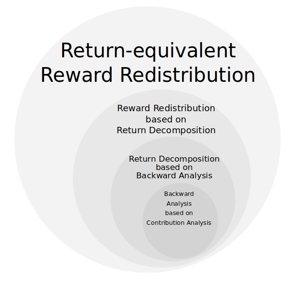

Imagine you have a reward ledger, which tracks your expected accumulated reward but you are not aware of it. At each time step the reward ledger is updated according to the current expectation. Assume that the ledger is non-empty, then nothing is stopping you from receiving the expected reward immediately, thereby emptying the ledger. This reward accounting is exploited by RUDDER, where a change of your ledger leads to an immediate pay out, i.e. reward, which sets the ledger to zero again. The defining property of an optimal return decomposition is that the ledger is always zero and emptied immediately if it deviates from zero, thus **no future reward is expected**.

We define optimal return decomposition via the optimality condition that the expected future accumulated reward is always zero. As a consequence, the new SDP **does not have delayed rewards** and **Q-value estimates are unbiased**.

      

        <label for="a6">Reward redistribution (details):</label>
        <input type="checkbox" name="sr" id="a6" hidden />
        

          
          {{ accordion_include | markdownify }}
        

      

    

​In the example task, an optimal return decomposition means that the whole reward is given after your decision in the beginning whether to repair a watch of a particular brand. This optimal return decomposition ensures that the expected future reward is zero. If some unforeseen events happen during delivery, the reward ledger is updated such that the expected future return stays zero.

​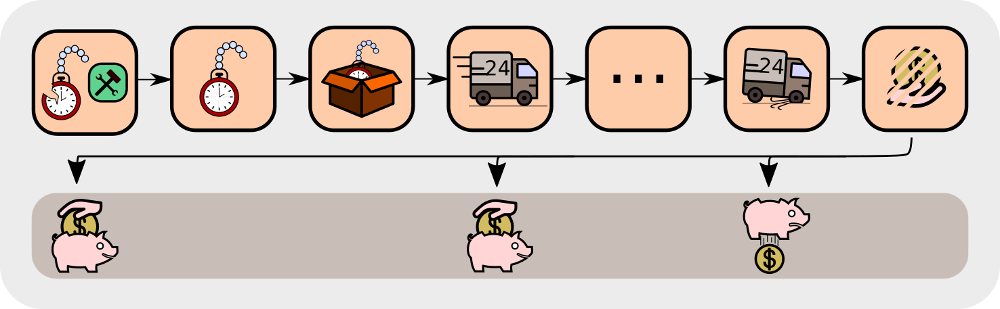  

# RUDDER vs potential-based reward shaping
​
Reward shaping in the RL community is known via potential-based [**reward shaping**][reward-shaping], [**look-ahead and look-back advice**][look-ahead]. These methods use as new reward the original reward augmented by a shaping reward ($$\text{reward}^{\text{new}} = \text{reward}^{\text{old}} + \text{reward}^{\text{original}}$$). The shaping reward is obtain via potential function differences. In contrast, RUDDER constructs a completely new reward function, which substitutes the origin reward ($$\text{reward}^{\text{new}} = \text{reward}^{\text{redistributed}}$$). 

​Redistributing the reward via reward shaping, look-ahead advice, and look-back advice is a special case of reward redistribution. We have shown that subtracting a constant from the potential function of the reward shaping methods makes the shaping rewards sum to zero ($$\sum_t \text{reward}_t^{\text{shaping}} = 0 $$), while all potential differences (shaping rewards) are kept. Hence, the reward redistribution leads to new SDPs that are return-equivalent to the original MDP. However, since these reward shaping approaches keep the original reward, their reward redistribution does not correspond to an optimal return decomposition (no delayed rewards) and therefore, learning by TD can still be exponentially slow for the remaining delayed rewards. **RUDDER is not potential-based reward shaping**.

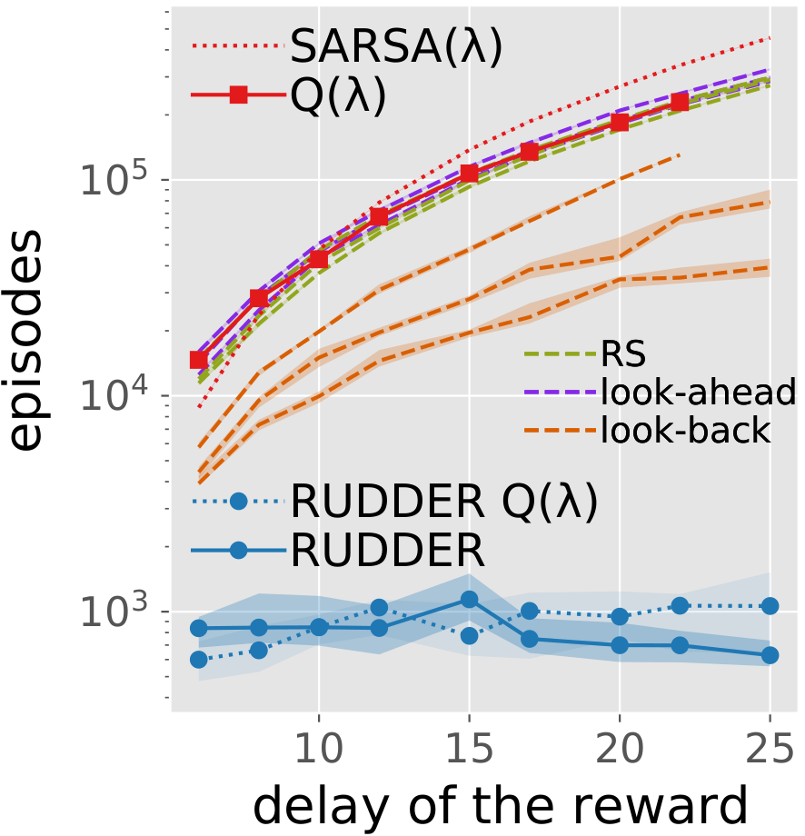

&nbsp;

The figure taken from the paper shows the comparison of RUDDER with reward shaping approaches. In detail, we compare RUDDER to Q-learning with eligibility traces, SARSA with eligibility traces, reward shaping (RS original), look-ahead advice (RS look-ahead), look-back advice (RS look-back). For each method, the learning time (in episodes) needed for solving the task versus the delay of the reward is plotted. The dashed blue line represents RUDDER applied on top of Q-learning with eligibility traces (RUDDER Q). In all cases, RUDDER is exponentially faster and outperforms reward shaping methods significantly.  

&nbsp;

# LSTM in RUDDER
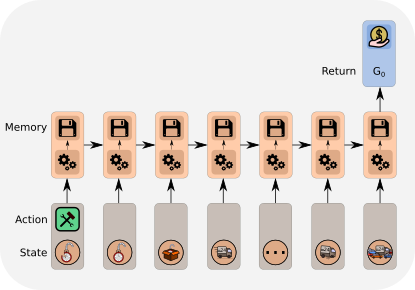

​We have already seen that RUDDER detects key events and assigns credit to them when associated rewards are delayed. This way, relevant actions and states can be identified even if they occured much earlier than the reward. The identification is done by **Deep Learning** which excels at **pattern recognition problems**. Over the past years, the Long Short-Term Memory ([**LSTM**][lstm]) has gained huge momentum in sequence analysis. For a nice introduction into Recurrent Neural Networks in general and the LSTM in particular have a closer look at [**Andrew Karpathy's blog**][karpathy]. In RUDDER, an LSTM is the obvious choice for the return prediction function,  which allows for the return decomposition and is based on a state-action sequence. By analyzing the whole episode, LSTM detects the key events that correlate with the reward the most.

&nbsp;

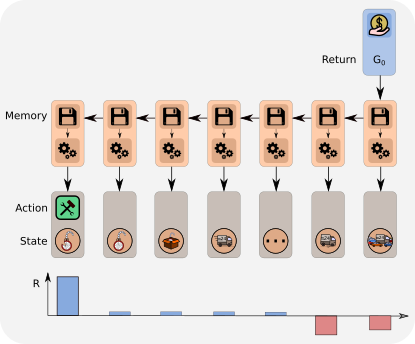
# Reward redistribution via LSTM
When the LSTM detects the key events, a piece of information gets stored in LSTM's memory. Then it is used for the prediction at the end. By analyzing LSTM's memory, we can reconstruct these pieces of information and assign contributions of individual states-action pairs to the final reward prediction.  

&nbsp;

&nbsp;

&nbsp;

# RUDDER in practice
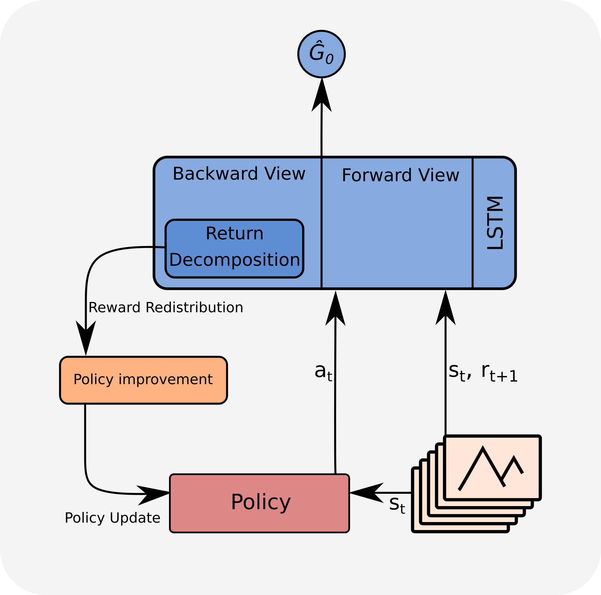
RUDDER's novel learning algorithm is the direct estimation of $$Q$$-values. However, RUDDER can be combined with any RL algorithm by using the redistributed reward as a new reward. We prefer to use the direct $$Q$$-value estimation applied to [**policy gradient**][pg] algorithms, in particular PPO (see the excellent blogs of the [**authors**][ppo_auth] and [**Jonathan Hui**][hui_blog]).

The LSTM uses the state-action sequence as input to predict the return. The learned LSTM model allows to perform return decomposition via a contribution analysis method. This return decomposition can be applied to any state-action sequence with an assigned return to redistribute the reward. This redistribution is even valid for state-action sequences that were obtained from a different policy than the policy on which LSTM was trained and on which the return decomposition was determined.

## FAQ:

      

        <label for="a3">Will the LSTM use the whole sequence and not only the last state-action pair?</label>
        <input type="checkbox" name="sr" id="a3" hidden />
        

          
          {{ accordion_include | markdownify }}
        

      

    

      

        <label for="a4">Is the LSTM a value function?</label>
        <input type="checkbox" name="sr" id="a4" hidden />
        

          
          {{ accordion_include | markdownify }}
        

      

    

      

        <label for="a5">Why not using the LSTM directly as a value function?</label>
        <input type="checkbox" name="sr" id="a5" hidden />
        

          
          {{ accordion_include | markdownify }}
        

      

    

    

--------------------------------------------------------------------------------
--------------------------------------------------------------------------------
# RUDDER demonstration code
You can find the code for the example task described in this blog [here][demo_rudder].

You can find a practical tutorial on how to perform reward redistribution [here][tutorial-rudder].

You can find our github repo [here][rudder-github].

--------------------------------------------------------------------------------
--------------------------------------------------------------------------------

# Video of RUDDER in the ATARI game Bowling

The video below shows RUDDER at work in the delayed ATARI game **Bowling**. Here the agent has to roll a ball towards 10 pins with the objective of knocking them down. In Bowling the agent has two ways of influencing the outcome. First, by the start-position the agent takes when he rolls the ball and secondly, while the ball is rolling by curving the ball towards the pins. The agent is rewarded only after the roll finished. As shown in the video, RUDDER manages

* to distribute the reward to actions which successfully allowed to curve the ball towards the pins,
* to assign negative rewards for not knocking all of the pins down,
* rolling a strike (as indicated by the blinking scores).  

<iframe width="560" height="315" src="https://www.youtube.com/embed/-NZsBnGjm9E" frameborder="0" allow="accelerometer; autoplay; encrypted-media; gyroscope; picture-in-picture" allowfullscreen></iframe>

## Correspondence

This blog post was written by Johannes Brandstetter: brandstetter[at]ml.jku.at

Contributions by Jose Arjona-Medina, Michael Gillhofer, Michael Widrich, Vihang Patil and Sepp Hochreiter.

[jekyll-docs]: https://jekyllrb.com/docs/home
[jekyll-gh]:   https://github.com/jekyll/jekyll
[jekyll-talk]: https://talk.jekyllrb.com/

[arxiv-paper]: https://arxiv.org/abs/1806.07857
[capture-the-flag]: https://deepmind.com/blog/article/capture-the-flag-science
[starcraft-paper]: https://arxiv.org/abs/1708.04782v1
[Marlo-Challenge]: https://www.crowdai.org/challenges/marlo-2018
[Dota-blog]: https://blog.openai.com/openai-five/
[Und-Dota-5]: https://medium.com/@evanthebouncy/understanding-openai-five-16f8d177a957
[sutton-thesis]: http://www.incompleteideas.net/papers/Sutton-PhD-thesis.pdf
[sutton-book]: http://www.incompleteideas.net/book/the-book.html
[int-grad]: https://arxiv.org/pdf/1703.01365.pdf
[lrp]: http://iphome.hhi.de/samek/pdf/BinICISA16.pdf
[reward-shaping]: https://dl.acm.org/doi/10.5555/645528.657613
[look-ahead]: https://dl.acm.org/doi/10.5555/3041838.3041938
[lstm]: http://colah.github.io/posts/2015-08-Understanding-LSTMs/#lstm-networks
[karpathy]: http://karpathy.github.io/2015/05/21/rnn-effectiveness/
[pg]: https://towardsdatascience.com/policy-gradients-in-a-nutshell-8b72f9743c5d
[ppo_auth]: https://openai.com/blog/openai-baselines-ppo/
[hui_blog]: https://medium.com/@jonathan_hui/rl-proximal-policy-optimization-ppo-explained-77f014ec3f12
[demo_rudder]: https://github.com/ml-jku/rudder-demonstration-code/
[tutorial-rudder]: https://github.com/widmi/rudder-a-practical-tutorial
[rudder-github]: https://github.com/ml-jku/rudder
